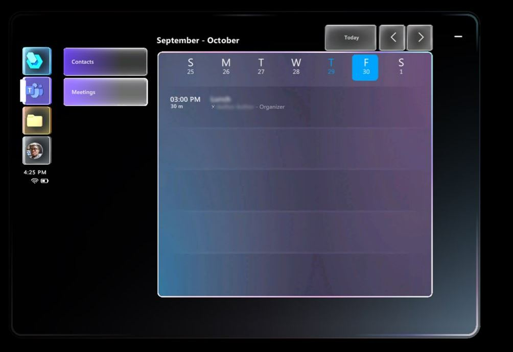
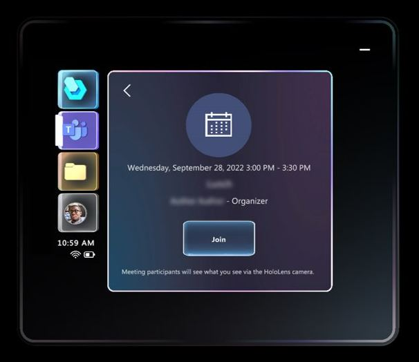

# Join a meeting or live event on Dynamics 365 Guides HoloLens

You can join a Microsoft Teams meeting or Microsoft Teams live event by using Dynamics 365 Guides on HoloLens. A [Microsoft Teams meeting](/microsoftteams/quick-start-meetings-live-events) is a meeting **scheduled** with Teams that includes any number of participants. A [Microsoft Teams live event](/microsoftteams/teams-live-events/what-are-teams-live-events) is an extension of a Teams meeting used to broadcast video and meeting content to a large online audience. A Microsoft Teams live event is useful for one-to-many communications where the host of the event is leading the interactions and audience participation is primarily limited to viewing the content shared by the host. A Dynamics 365 Guides HoloLens user can join a live event as a presenter or attendee in the same way that they join a meeting.

> [!IMPORTANT] 
> To join a meeting from Dynamics 365 Guides on HoloLens, you must have an Exchange Online license (not Exchange on-premises). 

## Join a scheduled meeting

1. Look at the palm of your hand to open the Main menu, and then select the **Communications** button.

    
    
2. Select **Meetings**

    

    The Meeting window opens to the current day so you can see all of your meetings for that day. 

    

    > [!NOTE]
    > Dynamics 365 Guides supports the default calendar only. (???no option to choose the calendar or view meetings from all calendars user has???)

    To change to a different day, select the day at the top of the screen. To switch to a different week, use the arrows in the upper right-corner of the screen. To go back to the current day at any time, select **Today**. 

    

    The bottom of the Meeting window shows the meeting time and duration (left side) and whether the meeting is occurring now (right side). 

   
    
3. To open a specific meeting, select the meeting. You'll see the meeting details, including the meeting date and time, meeting name, and organizer. 

    

4. Select **Join** to join the meeting. You'll see the following screen while participants are joining the meeting.
    
    

    When a participant joins the meeting, their avatar is displayed in the upper-right corner of the Meeting window. 

    
    
## Add a participant from your organization to the meeting

To add a participant to the call that was included in the original invite:

## Admit a participant from outside your organization
    
If a participant wants to join the meeting, but they're not part of your organization, a notification appears at the top of the screen to let you know that the participant is waiting in the Lobby, and a **Participants button** with a red dot (showing action required) appears at the bottom-right corner of the screen. 

    
To admit or decline the participant:

- Select the **Participants** button to display participant tiles on the right of the screen. In the first tile, select **Admit** or **Decline**. 

    

> [!NOTE]
> The meeting organizer can decide who is admitted into a meeting directly and who has to wait for someone to admit them. [Learn more about choosing who can bypass the lobby](https://support.microsoft.com/en-us/office/change-participant-settings-for-a-teams-meeting-53261366-dbd5-45f9-aae9-a70e6354f88e). 
> Dynamics 365 Guides users might not be able to join scheduled meetings between different companies if link-rewriting (URL-rewriting services) are used to fight spam. To make sure that users can join scheduled meetings in this situation, add an exception so that links from teams.microsoft.com are not rewritten. 

[!INCLUDE[footer-include](../includes/footer-banner.md)]
