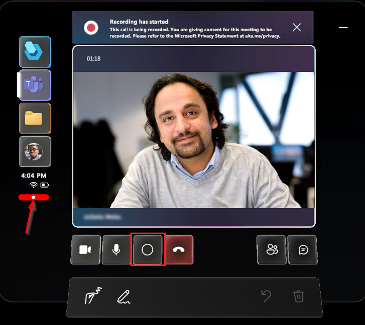
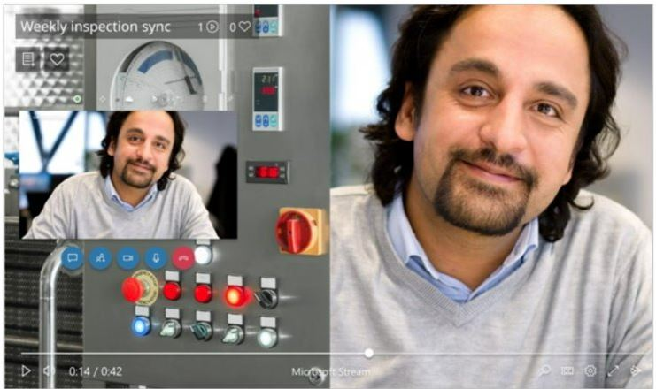
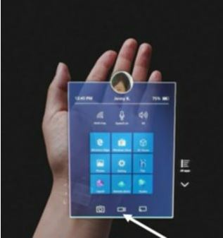

# Record a call from the Dynamics 365 Guides HoloLens app

Recording a call in the Microsoft Dynamics 365 Guides HoloLens app is great for training or record-keeping purposes. The HoloLens app creates cloud-based recordings that are automatically uploaded to OneDrive for Business for the user who initiates the recording. When the recording finishes uploading, all call participants can access the recording through Microsoft Teams chat.

You can record one-to-one or group calls. [Learn about prerequisites for Teams cloud meeting recordings and additional exceptions](/microsoftteams/cloud-recording#prerequisites-for-teams-cloud-meeting-recording)

> [!NOTE]
> A cloud recording layout is different from what participants in a call see. On a call, the video of the HoloLens user takes over the full stage for Teams users. In the recording, all video streams have the same amount of screen space. Read more about the [layout for this type of call](#cloud-based-recording-layout) before deciding whether to record using this method. You may also want to consider [alternatives to cloud-based recordings](#alternatives-to-cloud-based-recording). 

Recordings of scheduled Teams channel meetings are saved to the SharePoint folder for that channel. 

Call recording is not available to users [signed in to Dynamics 365 Guides as a guest](admin-add-guest-user.md).

## Overview of cloud-based recording 

A cloud-based call recording can be initiated by the Dynamics 365 Guides Hololens user or the Teams user. The recorder is the owner of the video. The owner needs to give permission or download the video to share the recording beyond people on the call.

## Start a recording from the HoloLens app

1. Select the **Recording** button. You'll see a message that lets you know that you're giving consent for the meeting to be recorded.

  At the bottom left of the video card, you'll see an indicator to let you know that you're recording. This indicator remains visible even if you do another action such as opening a guide or file, so you always know whether a recording is ongoing.

  

1. To end the recording, press the **Recording** button again or end the call.

   You'll see a reminder that the recording is being processed and saved securely in OneDrive for Business or SharePoint.

After the recording is processed and saved, it will appear in your Teams chat history. To view all the call recordings you initiated, go to your OneDrive for Business or SharePoint folder. 

## Start a recording from Teams

[Learn about using Teams to record the call](https://support.microsoft.com/office/record-a-meeting-in-teams-34dfbe7f-b07d-4a27-b4c6-de62f1348c24)

## Cloud-based recording layout 

The layout of the cloud-based recording depends on the number of call participants, and the layout cannot be configured. When using Dynamics 365 Guides or Teams to record the call, the Dynamics 365 Guides HoloLens user's view (their outgoing video feed) never occupies the entire recording unless the HoloLens user is the only person in a call or meeting. 

If it's imperative that your recording capture as much of the HoloLens user's view as possible and as little of the Teams user's outgoing video feed or avatars as possible, consider using one of the [alternative recording methods](#alternatives-to-cloud-based-recording). 

If you use Teams or Dynamics 365 Guides to record a call with two participants, each participant's outgoing video (or avatar) occupies one-half of the recording, and both halves are vertical. This means that during a Dynamics 365 Guides call, a Teams user sees a horizontal slice of what the Dynamics 365 Guides user sees, but the recording only captures the middle vertical slice of what the Dynamics 365 Guides user sees. Furthermore, during the Dynamics 365 Guides call, the Teams user only sees their outgoing video feed in the corner of the call, but in the recording, their outgoing video feed occupies half the recording. (If the Teams user turns off their outgoing video feed, their avatar will occupy half the recording.)

## Alternatives to cloud-based recording

Consider the following alternatives to cloud-based recording if the cloud-based recording layouts don't work for your purposes. 

### Use the HoloLens operating system to record only what you see in the HoloLens, what you hear around you, and what you hear through the HoloLens speakers

Use this option when:

- No call participant can initiate a cloud-based call recording.

- You only want the recording to capture what you see through the HoloLens. For example, the recording will only show the participants in the Dynamics 365 Guides call if you manually navigate to the participants panel and it's in your field of view.

You can use the HoloLens operating system to record only what you see in the HoloLens, what you hear around you, and what you hear through the HoloLens speakers. There are three ways to do this:

1. From the **Start** menu:

   1. Select the **Video** button from the bottom tool pane.
  
   2. Air tap when you're ready to record.
  
   3. To stop recording, do the **Start Gesture**, and then press the **Video** button again.
  
      

      > [!NOTE]
      > If you use this method to record your environment outside a call, joining a call will end the recording.

2. By voice: 

    1. Say "Hey Cortana, Record a video."

    2. Cortana's blue ring will appear, and your voice command will be displayed on the screen.

    3. There will be a countdown from three to one, and then the recording will start.

    4. You'll see a red recording indicator in the top right-hand corner of your view while the recording is live.

    5. To stop recording, say "Hey Cortana, Stop recording."

    6. The video will be available in your **Camera Roll**. Use the **Start** menu to go to your camera roll.

3. By HoloLens hardware:

    - Press and hold the volume-up and volume-down buttons simultaneously until a three-second countdown begins. To stop recording, tap both buttons simultaneously.

    These videos are saved to the HoloLens camera roll. Keep in mind that the video will not be uploaded automatically, but there are two ways to get a photo or video off the HoloLens camera roll.

    **Upload to OneDrive**

      1. Go to the **Start** menu.
       
      2. Select the **Windows App Store**.
      
      3. Download the OneDrive app.
      
      4. Sign into OneDrive.
      
      5. Upload your file to OneDrive.

    **Manual connection to a PC with a USB-C cable**

      1. On a PC, access the internal storage through File Explorer.
      
      2. Go to **Pictures** > **Camera Roll folder**.

      3. Copy your images or videos from this folder.

    [Learn more about taking photos and videos and getting them off the device](/hololens/holographic-photos-and-videos#capture-a-mixed-reality-photo).

## See also

- [Call a remote collaborator](calling-start-call.md)
- [Join a scheduled meeting](calling-meetings.md)
- [Chat](calling-chat-file-sharing.md)
- [Screen and file sharing](calling-screen-sharing.md)
- [Annotations](calling-annotations.md)
- [Access OneDrive files](onedrive-files.md)
- [Teams users capabilities](calling-teams-users.md)
- [Where call data is stored](call-logging.md)

