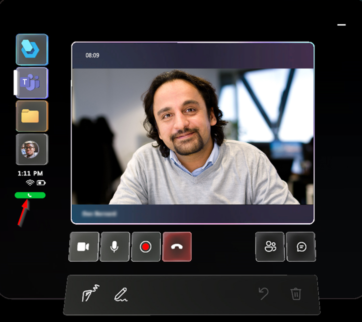
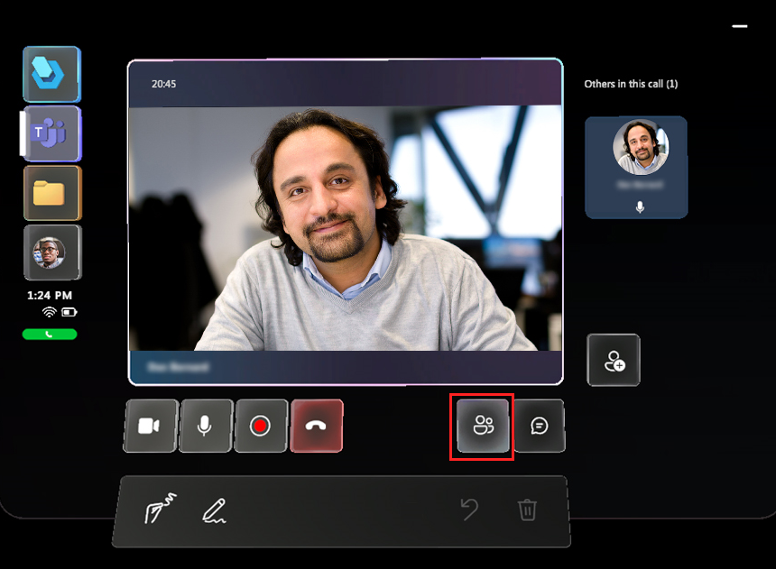
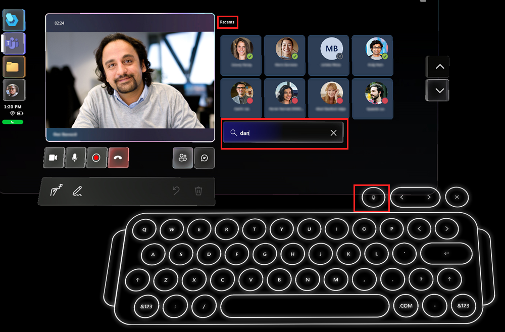

# Make or receive a call in Dynamics 365 Guides

When you're working in Microsoft Dynamics 365 Guides on HoloLens, you can make or receive calls on your HoloLens. 

## Start a one-to-one call

Start a call from your HoloLens. See [Types of calls](calling-concepts.md) for more information.

### Start a one-to-one call with a Teams contact in your organization

1. Look at the palm of your hand to open the **Main** menu, and then select the **Communications** button.

   :::image type="content" source="media/calling-meetings-1.JPG" alt-text="Screenshot of Communications button on Main menu.":::

1. Do one of the following:

    - If the contact you want to call is listed in the **Recent** list, select the contact.

    - If the contact isn't listed in the **Recent** list, place your cursor in the **Search** box, and then in the holographic keyboard that appears, enter the person's name or email address. Use the **Microphone** button if you prefer to use your voice to enter the person's name in the **Search** box.

      :::image type="content" source="media/calling-start-call-1.JPG" alt-text="Screenshot of Recent list with Search box below and holographic keyboard displayed.":::

1. In the window that appears, choose whether you want video on or off and then select the **Phone** button to call the contact.

   > [!TIP]
   > If your Teams policy for sharing video is not enabled, the option to turn on or off video is not available.

   <!---    --->

    You'll see the contact's video feed, activity controls, calling controls, and the **Annotate** toolbar. The green indicator below the activity controls shows that you're on a call with that contact. This is useful as a reminder in case you select a different type of activity, such as opening a guide or file.

    

> [!NOTE]
> You can't mute or remove a call participant in a one-to-one call.

### Start a one-to-one call with a Teams contact outside your organization

You can search for and call a Teams contact in another organization if your organization is federated with that organization. To call a federated contact, open Dynamics 365 Guides, select **Search**, and then use the holographic keyboard to enter their **full email address** (or use the **Microphone** button if you prefer to use your voice). You won't see any search results if you enter just a name or a partial email address.

After you call a federated contact, they appear in your recent contacts list, so you don't have to search for that contact again.

>[!Note]
> If you can't find the contact you're looking for, it might be because Teams federation ([Teams external access](/microsoftteams/manage-external-access#:~:text=Enable%20your%20Organization%20to%20Communicate%20with%20another%20Teams,your%20organization%2C%20skip%20to%20step%205.%20See%20More.)) has not been enabled. Contact your administrator for help.

## Start a group call

A group call can include a Dynamics 365 Guides user on HoloLens and a Teams user or Dynamics 365 Remote Assist mobile user. For more information, see [Group calls](calling-concepts.md#group-calls).

1. Start by calling one person as described above for a one-to-one call, and then select the **Open participants** button (or say "Guides, Open participants").

    

    When you select the **Open participants** button, tiles for all participants on the call appear to the right of the video feed. The first tile shows the first person that you called.

1. Select the **Add participants** button in the participants area (to the right of the video feed) to display a list of recent contacts.

    

1. Do one of the following:

    - If the contact you want to add is listed in the **Recent** list, select the contact's tile, and then select **Show video**.

    - If the contact isn't listed in the **Recent** list, place your cursor in the **Search** box, and then in the holographic keyboard that appears, enter the person's name or email address. Use the **Microphone** button if you prefer to use your voice to enter the person's name in the **Search** box.

      

### Mute a participant in a group call

1. Select the **Open participants** button or say "Guides, Open participants."

1. Select the tile for the participant that you want to mute.

1. When the tile flips over, select **Mute**. Muted participants can unmute themselves.

> [!NOTE]
> If the call includes a large number of participants, you might experience performance issues, such as delays in viewing annotations and lower video resolution. [Learn more about the number of participants that can join a Microsoft Teams call.](/microsoftteams/limits-specifications-teams#meetings-and-calls).

### Remove a participant in a group call

1. Select the **Open participants** button or say "Guides, Open participants."

1. Select the tile for the participant that you want to remove.

1. When the tile flips over, select **Remove**.

## Receive a call from a remote collaborator

When working in Guides, a notification displays when someone calls you. You can:

- Select **Video** or say "Guides, Video on?" to accept the call with your video on, showing the remote collaborators your view.

- Select **Phone** or say "Guides, Mic on?" to accept the call with audio only.

- Select **Ignore** or say "Guides, Ignore?" to decline the call.

## End a call

- Select the **End call** button or say "Guides, End call."

## Next steps

- [Join a scheduled meeting](calling-meetings.md)
- [Chat](calling-chat-file-sharing.md)
- [Record a call](calling-record-call.md)

[!INCLUDE[footer-include](../includes/footer-banner.md)]
